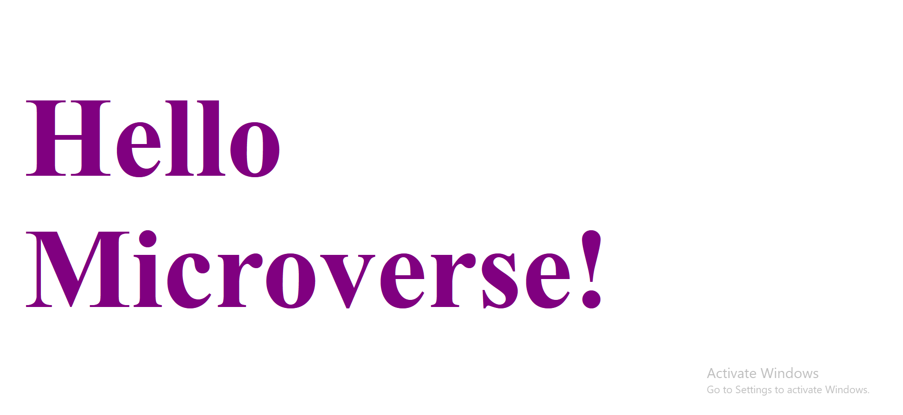

# Hello Microverse

> This is a simple project that displays the text "Hello Microverse!" in my favourite color. 

Additional description about the project and its features.

## Built With

- HTML 5
- CSS 3

## Getting Started

## Getting Started

To get a local copy up and running follow these simple example steps.
- Clone the repository with:
`git clone https://github.com/blakbox23/hello-microverse.git`

To get a local copy up and running follow these simple example steps.

## Authors

👤 **Peter Mbuthia**

- GitHub: [@Blakbox23](https://github.com/blakbox23)
- Twitter: [@blakbox23](https://twitter.com/blakbox23)
- LinkedIn: [Peter Mbuthia](https://www.linkedin.com/in/peter-mbuthia)

## 🤝 Contributing

Contributions, issues, and feature requests are welcome!

Feel free to check the [issues page](/issues/).

## Show your support

Give a ⭐️ if you like this project!

## Acknowledgments

- Hat tip to anyone whose code was used
- Inspiration
- etc

## 📝 License

This project is [MIT](./MIT.md) licensed.
